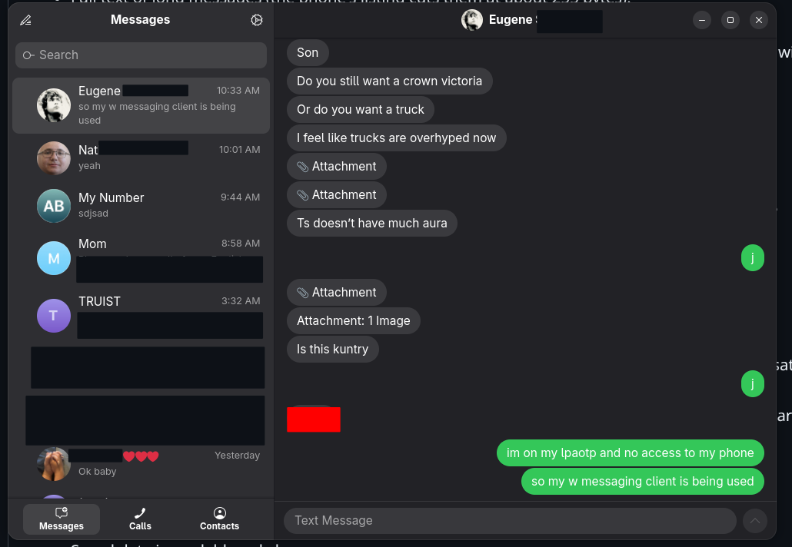

# iPhone messages over Bluetooth

Send and receive iPhone messages from a Linux desktop using the iPhone's Bluetooth Message
Access Profile (MAP) and Phonebook Access Profile (PBAP), through BlueZ's `obexd`.

## Features

**Messaging**
- Send and receive messages, with an iMessage-style GTK4 / libadwaita interface: chat bubbles,
  contact photos, day separators and emoji-only messages.
- Conversations of any length open instantly: rows are only built as they scroll into view.
- Sending indicator: a faint dot beside a message until the phone has accepted it, and
  "Not Delivered" if it fails.
- Message history kept on your computer (the phone only exposes its 10 newest), with delete for
  me, delete conversation, and undo.
- Per-conversation drafts, shown as "Draft:" in the sidebar once you leave the conversation.
- Full text of long messages (the phone's listing cuts them at about 255 bytes).
- Clickable links and phone numbers; copy message from the right-click menu.
- Start a conversation from a searchable contact picker (Ctrl+N), and jump between
  conversations with Ctrl+K.
- Search matches names, numbers and message text, with a snippet of the match.
- Marks messages read on the iPhone when you read them here.

**Phone**
- Contacts with photos, and call history (missed, incoming, outgoing) with calls shown inline
  in the conversation.
- Phone battery level in the header, with an optional low-battery alert.
- Now-playing bar with play, pause and skip (AVRCP); off by default.

**Desktop**
- Desktop notifications that open the conversation when clicked, with quiet hours and
  per-conversation mute.
- System tray icon with an unread badge; closing the window keeps the app running (`--hidden`
  starts it with no window).
- Keeps this computer out of the iPhone's audio output list while the app is open.
- Settings page (Ctrl+,) for notifications, quiet hours, tray, battery, audio and media.
- Command-line client: list, read, send, contacts, calls, battery, watch, shell.
- Saved data is readable only by you.

## Setup

- Packages: `bluez`, `bluez-obex`, `python-dbus`, `python-gobject`, `gtk4`, `libadwaita`.
- Pair the iPhone with `bluetoothctl` (or your desktop's Bluetooth settings).
- On the iPhone: Settings → Bluetooth → (i) next to this computer → turn on
  **Show Notifications** (messages) and **Sync Contacts** (contacts).

## Use

    ./imsg_gtk.py [--debug] [--hidden]   GTK app: chats, calls, contacts, drafts, tray icon, media controls
    ./imsg.py --help             command line: list, read, send, contacts, watch, shell

`--debug` (or `IMSG_DEBUG=1`) logs per-message detail to the terminal and to
`~/.cache/imsg/debug.log`. Without it only connection events and errors are logged.

## Layout

    imsg.py, imsg_gtk.py   launchers
    mapmsg/backend.py      obexd client: MAP (messages), PBAP (contacts), vCard parsing
    mapmsg/history.py      on-disk message history (seen + sent, deleted markers)
    mapmsg/battery.py      phone battery from BlueZ
    mapmsg/media.py        now playing + play/pause/next/previous (AVRCP)
    mapmsg/tray.py         system tray icon (StatusNotifierItem) and its menu
    mapmsg/settings.py     settings and muted chats (~/.config/imsg/settings.json)
    mapmsg/textutil.py     links, search snippets, truncation and quiet-hours helpers
    mapmsg/private.py      owner-only permissions for saved data
    mapmsg/audio.py        keeps this computer out of the phone's audio output list
    mapmsg/cli.py          command-line interface
    mapmsg/gtk_app.py      GTK4 / libadwaita app

## Limits (iOS)

- The phone lists only its 10 newest inbox messages, and never lists sent messages. The GTK app
  keeps its own history in `~/.cache/imsg/history.json` (everything it has seen or sent), so
  the history grows while the app runs. Messages older than the phone's window, and messages
  you send from the phone itself, can't be recovered.
- Attachments show as "📎 Attachment".
- Group chats are not distinguishable over MAP: iOS sends each group message as a plain
  message from one sender, with no participant or conversation information.
- If obexd gets stuck with "Internal Server Error" or "Connection refused", `pkill obexd`
  and wait a few seconds; the phone keeps a stale session for a while.
